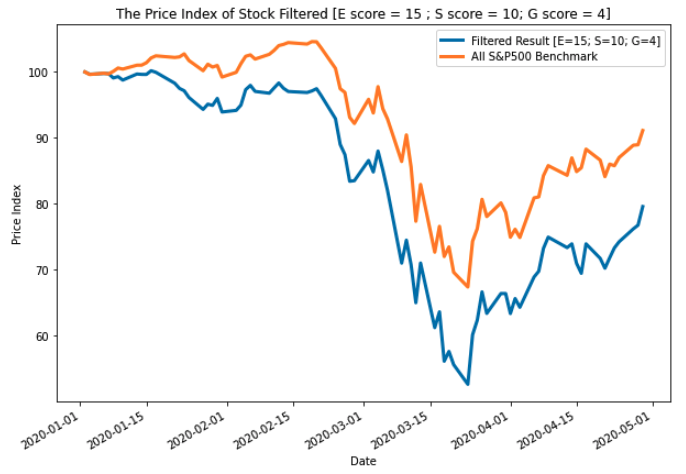
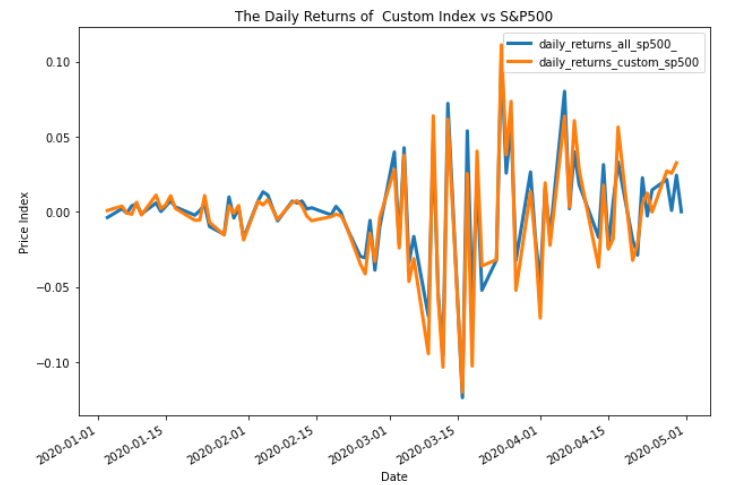
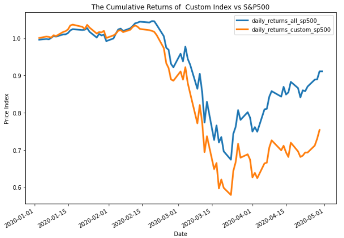

# Custom Indexing Project

####  Custom indexing represents a category shift in investing. It provides infinite customization around what investors care about: taxes, ESG, income, and other factors. It is a direct challenge to ETF and indexing funds.  This project intends to build a custom indexing engine that would allow an average investor to build their own index fund based on their values and also compare performance of the custom index to original benchmark index using Monte Carlo simulation.  It provides investors the ability to customize their funds based on their budget and thematic preferences.  New Index constituents are calculated by weights and fractional share allocation.

---








## Data Sources

```
Yahoo Finance Pricing Data API
Yahoo Finance ESG Data API
Open Data S&P 500 Security List
```

## Results and Conclusions 

1. Removing companies based on ethical considerations from the S&P 500 may reduce the performance of the custom index compared to the benchmark. 
2. We believe that investors would be comfortable with making a lower return from their investments in exchange for supporting only companies that align with their values in order to create a positive impact in the world. 
3. Our tool can empower investors to make an informed judgement on how to balance investment performance and ethical considerations to create an investment portfolio that they can be proud of. 


## Technologies

This project leverages python 3.7 with the following packages:

* [python] (https://wiki.python.org/moin/FrontPage) - is an object-oriented, interpreted, and interactive programming language.

* [pathlib] (https://docs.python.org/3/library/pathlib.html) - This module offers classes representing filesystem paths with semantics appropriate for different operating systems.

* [matplotlib] (https://matplotlib.org) - Matplotlib is a comprehensive library for creating static, animated, and interactive visualizations in Python.

* [numpy] (https://numpy.org) - NumPy brings the computational power of languages like C and Fortran to Python, a language much easier to learn and use. 

* [SQLAlchemy] (https://www.sqlalchemy.org) - SQLAlchemy is the Python SQL toolkit and Object Relational Mapper that gives application developers the full power and flexibility of SQL.

* [hvPlot] (https://hvplot.holoviz.org/) - hvPlot provides an alternative for the static plotting API provided by Pandas and other libraries, with an interactive Bokeh-based plotting API that supports panning, zooming, hovering, and clickable/selectable legends.

* [streamlit] (https://streamlit.io/) - Streamlit is an open-source app framework for Machine Learning and Data Science teams.

* [questionary] (https://questionary.readthedocs.io/en/stable/index.html)- Questionary is a Python library for effortlessly building pretty command line interfaces.

* [pyviz] (https://pyviz.org/)- The PyViz.org website is an open platform for helping users decide on the best open-source (OSS) Python data visualization tools for their purposes, with links, overviews, comparisons, and examples.

---

## Installation Guide

### Env. installation

Before running the application first install the following dependencies.

```
  python
  conda update conda
  conda update anaconda
  conda create -n dev python=3.7 anaconda
  activate dev
  
```
### Pyviz Installation

```
conda install -c pyviz pyviz
conda list hvplot
```
### Streamlit Installation
```
 conda activate dev
 pip install streamlit 
 type the following in gitbash to run the app in your browser < streamlit run streamlit_ux.py >
 ```
---
## Team Collaboration

Team members collaborated through Github respository, Slack and Zoom sessions. 

## Contributors

Brought to you by Kevin BaRoss, Christopher Diamond, Haoyu Chen, Hugo Kostelni, Siddharth Venkumahanti

## License

The MIT License (MIT)

Copyright (c) 2022 Kevin BaRoss, Christopher Diamond, Haoyu Chen, Hugo Kostelni, Siddharth Venkumahanti

Permission is hereby granted, free of charge, to any person obtaining a copy of this software and associated documentation files (the "Software"), to deal in the Software without restriction, including without limitation the rights to use, copy, modify, merge, publish, distribute, sublicense, and/or sell copies of the Software, and to permit persons to whom the Software is furnished to do so, subject to the following conditions:

The above copyright notice and this permission notice shall be included in all copies or substantial portions of the Software.

THE SOFTWARE IS PROVIDED "AS IS", WITHOUT WARRANTY OF ANY KIND, EXPRESS OR IMPLIED, INCLUDING BUT NOT LIMITED TO THE WARRANTIES OF MERCHANTABILITY, FITNESS FOR A PARTICULAR PURPOSE AND NONINFRINGEMENT. IN NO EVENT SHALL THE AUTHORS OR COPYRIGHT HOLDERS BE LIABLE FOR ANY CLAIM, DAMAGES OR OTHER LIABILITY, WHETHER IN AN ACTION OF CONTRACT, TORT OR OTHERWISE, ARISING FROM, OUT OF OR IN CONNECTION WITH THE SOFTWARE OR THE USE OR OTHER DEALINGS IN THE SOFTWARE.
